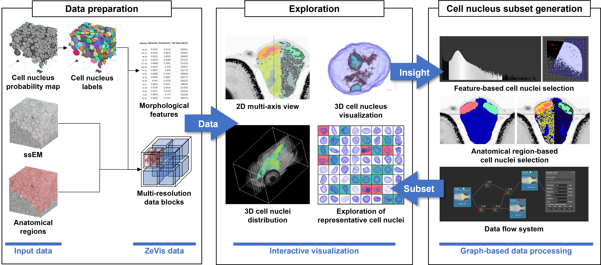

# ZeVis: A Visual Analytics System for Exploration of a Larval Zebrafish Brain in Serial-Section Electron Microscopy Images

Structure
-----------
- /Code: project (used visual studio 2017 version)
- /DataProcessing_parallel_matlab: image stack to zevis format data
- /Excutable: ZeVis tool
- /ProjectFiles: project files which can be loaded at the system.
- *.ZeVis: project file format
- *.annotation: annotation file format

## Contents

- [Overview](#overview)

# Overview

The automation and improvement of nano-scale electron microscopy imaging technologies have expanded a push in neuroscience to understand brain circuits at the scale of individual cells and their connections. Most of this research effort, called `connectomics', has been devoted to handling, processing, and segmenting large-scale image data to reconstruct graphs of neuronal connectivity. However, connectomics datasets contain a wealth of high-resolution information about the brain that could be leveraged to understand its detailed anatomy beyond just the connections between neurons, such as cell morphologies and distributions. This study introduces a novel visualization system, ZeVis, for the interactive exploration of a whole larval zebrafish brain using a terabyte-scale serial-section electron microscopy dataset. ZeVis combines 2D cross-sectional views and 3D volumetric visualizations of the input serial-section electron microscopy data with overlaid segmentation results to facilitate the analyses of various brain structures and their interpretations. The system also provides a graph-based data processing interface to generate subsets of feature segmentation data easily. The segmentation data can be filtered by morphological features or anatomical constraints, allowing statistical analysis and comparisons across regions. We applied ZeVis to actual data of a terabyte-scale whole-brain larval zebrafish and analyzed cell nucleus distributions in several anatomical regions.
